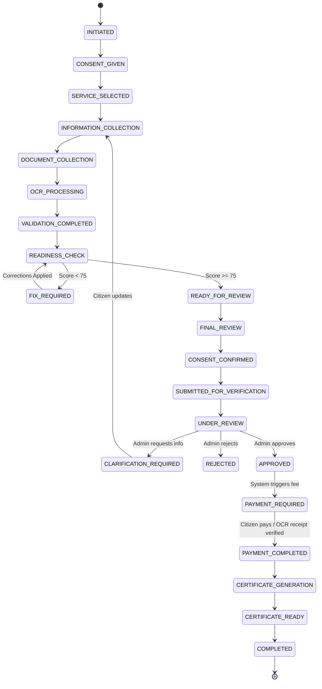

# Comprehensive Project Analysis & Architecture Pipeline Documentation
**Project:** Multilingual AI-Powered Citizen Revenue Services Platform (`Rev_gov_platform`)  
**Repository:** `https://github.com/kunalwandhare567/Rev_gov_platform`  
**Date:** August 2026  
**Document Version:** 1.0.0  

---

## 1. Executive Summary & Objective

The **Multilingual AI-Powered Citizen Revenue Services Platform** is an enterprise-grade, omnichannel conversational government services platform designed to streamline citizen applications for revenue certificates in India.

### Core Objective
To eliminate bureaucratic friction and digital divide barriers by allowing citizens to apply for statutory certificates through natural-language conversation in their preferred regional language across four primary channels:
1. **Web Portal** (`CitizenChat` + 4-Section `ApplicationReview`)
2. **WhatsApp** (`WhatsAppChat` conversational simulator)
3. **Voice / IVR** (`IVRSimulator` with speech synthesis & telephony state)
4. **Mobile Responsive Interface**

### Initial POC Services
1. **Income Certificate** (*Primary Golden Path POC*)
2. **Caste Certificate**
3. **Domicile Certificate**
4. **OBC Non-Creamy Layer (NCL) Certificate**

---

## 2. Core Architectural Principles

```
                       CITIZEN INTERACTION
            ┌──────────────────┬──────────────────┐
            ▼                  ▼                  ▼
       WhatsApp UI          Web Chat         Voice / IVR
       (+91-Phone)       (Tokenized ID)     (Caller Phone)
            │                  │                  │
            └──────────────────┼──────────────────┘
                               ▼
                   CITIZEN IDENTITY RESOLVER
             (SHA-256 Hashes → Unified citizen_ref)
                               ▼
                  APPLICATION & SESSION REPO
             (Single Source of Truth: INC-2026-0001)
                               ▼
        ┌──────────────────────────────────────────────┐
        │        ORCHESTRATION & NLU PIPELINE          │
        ├──────────────────────────────────────────────┤
        │  1. Language Detection (7 Indian Languages)  │
        │  2. Data Guard (PII Classification & Block)  │
        │  3. Cloud LLM (Gemini / Groq / OpenRouter)   │
        │  4. Dynamic Question Engine (YAML-driven)    │
        │  5. Cross-Question & RAG Grounding           │
        └──────────────────────────────────────────────┘
                               │
            ┌──────────────────┼──────────────────┐
            ▼                  ▼                  ▼
     TESSERACT OCR      RULES ENGINE       READINESS ENGINE
    (Field Extract)   (Deterministic)    (0-100 Score Check)
            │                  │                  │
            └──────────────────┼──────────────────┘
                               ▼
                    CITIZEN FINAL REVIEW
                 (4-Section Web Form & Consent)
                               ▼
                  MOCK GOVERNMENT VERIFICATION
                   (Under Review → APPROVED)
                               ▼
                     PAYMENT GATEWAY / OCR
                  (Payment ONLY after Approval)
                               ▼
                    CERTIFICATE GENERATION
                    (PDF & Status Tracking)
```

1. **Single Source of Truth**: There is exactly ONE central application database record (`Application` with unique `tracking_id`) per citizen application. All channels (Web, WhatsApp, IVR) read and write to this identical record.
2. **Deterministic Governance vs. Probabilistic LLM**:
   - **LLM Responsibility**: Natural language understanding, multilingual dialogue, cross-question explanation, empathy, and conversational resume. The LLM **never** decides eligibility, fees, or document validity.
   - **Deterministic Engines**: Validation, eligibility, fees, document matching score, application readiness score, and lifecycle FSM are strictly computed by Python code and YAML rules.
3. **Zero Local Fallback / No Ollama**: The conversational AI strictly utilizes a single configured external API provider (**Gemini**, **Groq**, or **OpenRouter**). If the provider is unavailable, it fails fast with a controlled 503 error rather than falling back to local/keyword engines.
4. **Correct FSM Lifecycle (Payment Post-Approval)**: Payment occurs **strictly after** government verification approval, not before.

---

## 3. Technology Stack & Directory Structure

### Backend Stack
- **Framework**: FastAPI (Python 3.10+) with Uvicorn
- **Database / ORM**: SQLite (WAL mode) with SQLAlchemy 2.0
- **Configuration & Validation**: Pydantic v2 & Pydantic Settings
- **OCR Engine**: Tesseract OCR (`pytesseract`) + Heuristic Regex Matcher
- **Security & Cryptography**: AES-256-GCM field-level encryption, SHA-256 identity hashing, Passlib (PBKDF2/SHA256)
- **External LLM Integrations**: `google-generativeai` (Gemini), `httpx` (Groq & OpenRouter REST APIs)

### Frontend Stack
- **Framework**: React 19 + Vite 6
- **Routing**: React Router DOM v7
- **State Management**: Zustand stores (`chatStore`, `uiStore`, `authStore`)
- **Styling**: Vanilla CSS Modules (Glassmorphism, High-contrast, Dark mode accents)
- **Icons & Visuals**: `lucide-react`, `recharts`

### Repository Layout

```
Rev_gov_platform/
├── backend/
│   ├── app/
│   │   ├── api/
│   │   │   └── routes/           # REST & SSE API endpoints
│   │   │       ├── applications.py
│   │   │       ├── conversation.py
│   │   │       ├── documents.py
│   │   │       ├── ivr.py
│   │   │       ├── mock_government.py
│   │   │       ├── payment.py
│   │   │       ├── stream.py
│   │   │       ├── tracking.py
│   │   │       └── whatsapp.py
│   │   ├── channels/             # Channel adapters (Web, WhatsApp, IVR, Mobile)
│   │   ├── core/                 # Config, DB connection, Security middleware
│   │   ├── data_guard/           # PII Scanner, OPA policy enforcement
│   │   ├── data_layer/           # Repositories & AES-256 encryption
│   │   ├── llm/                  # LLM Provider Abstraction & Providers
│   │   │   ├── base.py
│   │   │   ├── gemini_provider.py
│   │   │   ├── groq_provider.py
│   │   │   ├── openrouter_provider.py
│   │   │   ├── provider_factory.py
│   │   │   └── llm_service.py
│   │   ├── models/               # SQLAlchemy DB Models
│   │   ├── orchestration/        # NLU, Field Corrector, State Machine & Orchestrator
│   │   ├── rules_engine/         # YAML spec loader, validator, eligibility, fraud
│   │   └── services/             # Readiness, Matching, OCR, RAG, STT/TTS, Payments
│   ├── knowledge/                # Markdown knowledge base for RAG (4 services)
│   ├── seed/
│   │   └── service_specs/        # Authoritative YAML specifications
│   ├── tests/                    # 16 Comprehensive pytest test suites
│   ├── main.py                   # FastAPI Application Entrypoint
│   └── requirements.txt
├── frontend/
│   ├── src/
│   │   ├── api/                  # API client & endpoint helpers
│   │   ├── layouts/              # CitizenLayout, RootLayout, AuthGuard
│   │   ├── pages/
│   │   │   ├── ApplicationReview/# 4-Section Web Application Review Form
│   │   │   ├── CitizenChat/      # Main web conversational interface
│   │   │   ├── WhatsAppChat/     # WhatsApp Web Simulator
│   │   │   ├── IVRSimulator/     # Voice telephony simulator
│   │   │   ├── StatusTracker/    # Public status lookup
│   │   │   ├── AdminDashboard/   # Verification & Decision Officer/Admin UI
│   │   │   └── DataGuardDemo/    # Live PII boundary inspection
│   │   └── store/                # Zustand global state
│   ├── package.json
│   └── vite.config.js
└── plan/                         # Project architecture & iteration blueprints
```

---

## 4. In-Depth Pipeline Implementations

Below is the complete analysis of all 15 pipelines currently implemented across the platform:

---

### Pipeline 1: Citizen Identity Resolution & Omnichannel Sync Pipeline
- **Files**: `backend/app/services/citizen_resolver.py`, `backend/app/models/db_models.py`, `backend/app/data_layer/repositories/channel_identity_repo.py`
- **Mechanism**:
  1. Citizen enters via any channel (WhatsApp phone number `+919876543210`, Web session ID, or IVR caller ID).
  2. The identifier is hashed with **SHA-256**. The raw identifier is never stored as a primary key.
  3. `ChannelIdentity` maps `(channel, identifier_hash)` $\to$ `citizen_ref` (e.g. `CITIZEN-05a9c9f8`).
  4. `get_active_application(citizen_ref)` looks up any ongoing non-terminal application (`INC-2026-0001`).
  5. If an application exists, the incoming channel seamlessly hooks into the same session without creating a duplicate application.

---

### Pipeline 2: Conversational NLU & Language Understanding Pipeline
- **Files**: `backend/app/orchestration/nlu/local_llm.py`, `backend/app/llm/llm_service.py`, `backend/app/llm/gemini_provider.py`, `backend/app/llm/groq_provider.py`, `backend/app/llm/openrouter_provider.py`
- **Mechanism**:
  1. Citizen utterance is received with language tag (supports English, Hindi, Marathi, Bengali, Gujarati, Tamil, Telugu).
  2. Data Guard intercepts utterance to ensure no raw restricted PII is forwarded unnecessarily.
  3. Active Cloud LLM provider (`GeminiProvider`, `GroqProvider`, or `OpenRouterProvider`) is invoked with structured JSON Schema prompt.
  4. The LLM extracts:
     - `intent`: (`CERTIFICATE_REQUEST`, `STATUS_QUERY`, `SLOT_ANSWER`, `CROSS_QUESTION`, `CORRECTION`, `HELP`, `CANCEL`)
     - `service_type`: (`income_certificate`, `caste_certificate`, `domicile_certificate`, `obc_ncl_certificate`)
     - `entities`: Dictionary of extracted key-value pairs (e.g., `{"applicant_name": "Kunal Wandhare", "annual_income": "300000"}`)
     - `is_cross_question`: Boolean flag indicating if citizen asked a side-question.
     - `cross_question_target`: Field name in question (e.g., `father_name`).
  5. Fails fast with `LLMUnavailableError` (HTTP 503) if the external provider fails.

---

### Pipeline 3: Dynamic Question & Slot Filling Pipeline
- **Files**: `backend/app/services/next_question_engine.py`, `backend/app/rules_engine/engine.py`
- **Mechanism**:
  1. `NextQuestionEngine.get_next_slot()` checks:
     - All `required` slots defined in the service YAML spec.
     - `session.filled_slots` (already provided by citizen in conversation or web).
     - `ocr_fields` (auto-filled from uploaded documents).
     - `validation_errors` (fields that failed type/pattern validation).
  2. Slots are prioritized dynamically:
     - Identity: `applicant_name` $\to$ `applicant_dob` $\to$ `gender`
     - Contact: `mobile_number` $\to$ `email`
     - Family: `father_name` $\to$ `mother_name`
     - Location: `address` $\to$ `district` $\to$ `taluka` $\to$ `village`
     - Financial/Specific: `occupation` $\to$ `annual_income` $\to$ `family_member_count` $\to$ `purpose`
  3. If a slot was already extracted via Aadhaar OCR with high confidence, it is **skipped** automatically, preventing repetitive questions.
  4. The next missing slot specification is passed to the LLM to generate a natural, conversational question in the citizen's current language.

---

### Pipeline 4: Cross-Question Handling & Context Preservation Pipeline
- **Files**: `backend/app/orchestration/state_machine/orchestrator.py`, `backend/app/llm/llm_service.py`
- **Mechanism**:
  1. Conversation state maintains:
     ```json
     {
       "pending_field": "father_name",
       "pending_question": "What is your father's full name?",
       "service": "income_certificate"
     }
     ```
  2. Citizen asks a digression: *"Why do you need my father's name?"*
  3. `NLUService` flags `is_cross_question = True` and `cross_question_target = "father_name"`.
  4. `LLMService.answer_cross_question()` generates an explanation grounded in government service requirements:
     > *"Your father's name is required to verify family lineage and complete applicant records for the Income Certificate."*
  5. The orchestrator immediately appends the pending question to the response:
     > *"What is your father's full name?"*
  6. Application state and slot collection progress are preserved with zero data loss.

---

### Pipeline 5: RAG & Knowledge Grounding Pipeline
- **Files**: `backend/app/services/rag_service.py`, `backend/knowledge/`
- **Knowledge Base Structure**:
  - `backend/knowledge/income_certificate/` (`overview.md`, `eligibility.md`, `documents.md`, `process.md`, `faq.md`)
  - `backend/knowledge/caste_certificate/`
  - `backend/knowledge/domicile_certificate/`
  - `backend/knowledge/obc_ncl_certificate/`
- **Mechanism**:
  1. `RAGService` loads and parses markdown files split by `##` headers into `KnowledgeChunk` objects.
  2. On user inquiry (*"How long does verification take?"* or *"What documents are needed?"*), chunks are scored using keyword/token overlap with service-specific weighting.
  3. Chunks are passed into `LLMService.answer_rag()`. The system prompt strictly prohibits hallucination and restricts answers to provided knowledge.

---

### Pipeline 6: OCR Extraction & Document Processing Pipeline
- **Files**: `backend/app/services/ocr_service.py`, `backend/app/api/routes/documents.py`
- **Mechanism**:
  1. Citizen uploads document (PDF, PNG, JPG) via Web or WhatsApp.
  2. Document is saved into `./data/uploads/` and classified (`IDENTITY_PROOF`, `INCOME_PROOF`, `CASTE_PROOF`, `ADDRESS_PROOF`, `PAYMENT_RECEIPT`).
  3. `OCRService.process_document()` runs Tesseract OCR (with fallback simulated OCR for testing).
  4. Heuristic & regex extraction parses fields:
     - Aadhaar: `aadhaar_number` (12 digits), `applicant_name`, `dob`, `gender`, `address`
     - Income Proof / Salary Slip: `annual_income`, `gross_income`, `employer_name`
     - PAN: `pan_number` (10 alphanumeric), `applicant_name`, `dob`
  5. Extracted data is normalized and saved to `Document.extracted_fields`.

---

### Pipeline 7: Deterministic Document Matching Pipeline
- **Files**: `backend/app/services/matching_service.py`
- **Mechanism**:
  1. `MatchingService.compare_document()` compares `declared_fields` (from application) vs `extracted_fields` (from OCR).
  2. Uses field-specific string/numeric similarity comparators:
     - Names: Token sort, Levenshtein ratio (`difflib.SequenceMatcher`), fuzzy alias matching.
     - Dates: Normalized date parsing (`DD-MM-YYYY`, `YYYY-MM-DD`, `DD/MM/YYYY`).
     - Numbers/Aadhaar/PAN: Exact normalized comparison.
     - Income: Percentage deviation formula:
       $$\text{Score} = \max\left(0, 100 - \frac{|\text{declared} - \text{ocr}|}{\text{declared}} \times 100\right)$$
  3. Generates weighted overall document match score (e.g., `95.4%`).
  4. Categorizes fields into:
     - `matched_fields` ($\ge 85\%$)
     - `mismatched_fields` ($< 85\%$)
     - `fields_only_in_app`
     - `fields_only_in_doc`
  5. If mismatch exists, citizen is presented with resolution options (`use_declared` or `use_document`) in Web and WhatsApp.

---

### Pipeline 8: Application Readiness Scoring Pipeline
- **Files**: `backend/app/services/readiness_engine.py`
- **Mechanism**:
  Computes a 0–100 deterministic readiness score across 5 weighted dimensions:
  1. **Field Completeness (30 pts)**: Ratio of required YAML fields filled.
  2. **Document Coverage (25 pts)**: All mandatory documents uploaded.
  3. **OCR Validation (20 pts)**: Documents successfully OCR processed with match score $\ge 80\%$.
  4. **Eligibility Rules (15 pts)**: Evaluated by `EligibilityChecker` against YAML rules.
  5. **Cross-Field Consistency (10 pts)**: Valid age, phone regex, address length, income bounds.
  
  **Submission Gating**:
  - $\ge 90$: `READY` (Green)
  - $75 - 89$: `MINOR_ISSUES` (Amber — Submission permitted)
  - $60 - 74$: `MODERATE_ISSUES` (Blocked)
  - $< 60$: `MAJOR_ISSUES` (Blocked)

---

### Pipeline 9: Deterministic Rules & Fraud Scoring Pipeline
- **Files**: `backend/app/rules_engine/engine.py`, `backend/app/rules_engine/fraud_scorer.py`
- **Mechanism**:
  - `ServiceSpecLoader`: Reads and caches YAML specifications from `backend/seed/service_specs/`.
  - `FieldValidator`: Validates data types, lengths, regex patterns.
  - `EligibilityChecker`: Evaluates Python expressions (e.g. `applicant_age >= 18`, `annual_income <= 800000`).
  - `FeeCalculator`: Computes fee and applies 100% waiver if conditions match (e.g. `annual_income < 20000` or BPL card).
  - `FraudScorer`: Evaluates anomaly score based on rapid resubmissions, extreme mismatch rates, and unusual submission hours.

---

### Pipeline 10: Finite State Machine (FSM) & Lifecycle Pipeline
- **Files**: `backend/app/orchestration/state_machine/application_fsm.py`
- **Complete State Sequence**:



---

### Pipeline 11: Government Verification Simulation Pipeline
- **Files**: `backend/app/api/routes/mock_government.py`
- **Mechanism**:
  1. `POST /api/v1/mock-government/submit`: Transitions application from `CONSENT_CONFIRMED` $\to$ `SUBMITTED_FOR_VERIFICATION` $\to$ `UNDER_REVIEW`.
  2. `GET /api/v1/mock-government/status/{tracking_id}`: Retrieves complete application state for Admin Dashboard.
  3. `POST /api/v1/mock-government/simulate-decision`: Admin simulates government officer decision:
     - `APPROVE`: Transitions to `APPROVED` $\to$ immediately triggers `PAYMENT_REQUIRED` event.
     - `CLARIFICATION_REQUIRED`: Transitions to `CLARIFICATION_REQUIRED` $\to$ notifies citizen to provide additional documents.
     - `REJECT`: Transitions to `REJECTED` with reason recorded in audit log.

---

### Pipeline 12: Post-Approval Payment & Receipt OCR Pipeline
- **Files**: `backend/app/services/payment_service.py`, `backend/app/api/routes/payment.py`
- **Mechanism**:
  1. **Strict Guard**: `initiate_payment()` rejects any application that is not in `PAYMENT_REQUIRED` state (preventing pre-mature payments).
  2. Payment modes supported:
     - `MOCK_AUTO`: Simulated instant gateway payment.
     - `UPI_QR`: Generates QR payload.
  3. `POST /api/v1/payment/verify-receipt`: Citizen uploads payment screenshot. Tesseract OCR verifies transaction ID, amount, and timestamp.
  4. On successful payment verification, transitions application state to `PAYMENT_COMPLETED` $\to$ triggers `CERTIFICATE_GENERATION`.

---

### Pipeline 13: Certificate Generation & Tracking Pipeline
- **Files**: `backend/app/services/payment_service.py`, `backend/app/api/routes/tracking.py`
- **Mechanism**:
  1. When state reaches `CERTIFICATE_GENERATION`, system generates a certified digital certificate record with unique certificate number (`CERT-INC-2026-XXXX`).
  2. Creates physical mock PDF in `./data/certificates/`.
  3. Transitions state to `CERTIFICATE_READY` $\to$ `COMPLETED`.
  4. `GET /api/v1/tracking/{tracking_id}` provides open access for Web, WhatsApp, and IVR status lookups.

---

### Pipeline 14: Data Guard & Trust Boundary Pipeline
- **Files**: `backend/app/data_guard/guard.py`, `backend/app/data_layer/encryption.py`
- **Mechanism**:
  1. All database storage of restricted fields (Aadhaar, DOB, Name, Address) uses **AES-256-GCM** encryption.
  2. Outbound payloads are scanned by `DataClassifier`.
  3. `RESTRICTED` fields are blocked or redacted before forwarding to external LLM APIs (e.g. Aadhaar is masked to `XXXX-XXXX-1234`).
  4. Every access and redaction event is recorded in the immutable `AuditLog` table.

---

### Pipeline 15: Event-Driven Notification & Omnichannel Sync Pipeline
- **Files**: `backend/app/services/notification_service.py`, `backend/app/api/routes/stream.py`
- **Mechanism**:
  1. State changes emit an `ApplicationEvent` (`APPLICATION_CREATED`, `MISMATCH_DETECTED`, `READY_FOR_REVIEW`, `APPROVED`, `PAYMENT_REQUIRED`, `CERTIFICATE_READY`).
  2. In-app notifications are formatted in the citizen's preferred language and posted to their session.
  3. Web frontend listens to Server-Sent Events (SSE) at `/api/v1/stream/events` for real-time live status updates without full-page reloads.

---

## 5. Frontend Architecture & User Experience

### 1. Web Citizen Chat (`/chat`)
- Rich conversational window supporting markdown, quick-reply chips, voice recording via Web Speech API, real-time slot progress bar, and side-panel inspection (Form slots, Uploaded docs, Readiness score).

### 2. WhatsApp Simulator (`/whatsapp`)
- Pixel-perfect WhatsApp Web clone interface.
- Supports voice notes (STT), document attachments, interactive button chips, mismatch prompts, and live message history synchronized with the backend.

### 3. 4-Section Web Application Review (`/applications/:id/review`)
Designed specifically for the golden path review experience with 4 cohesive sections:
- **Section 1: Basic & Application Details**: Service type, Applicant Full Name, DOB, Mobile, Email, Address, Purpose (*editable with central persistence*).
- **Section 2: Personal & Family Details**: Father's Name, Mother's Name, Occupation, Annual Income, Family Member Count, Earning Members (*editable*).
- **Section 3: Documents & Validation**: Document card listing with OCR status, extracted fields, match scores, and mismatch resolution controls.
- **Section 4: Final Review & Consent**: Summary cards, Deterministic Readiness Score breakdown, Legal Consent Confirmation Checkbox, and **Submit for Government Verification** action button (*enabled only when readiness conditions pass*).

### 4. Admin & Verification Dashboard (`/admin/dashboard`)
- Allows administrative review of pending applications, inspection of OCR mismatch scores, readiness scores, and triggers the **Simulate Approval / Clarification / Rejection** action.

---

## 6. End-to-End Golden Flow Walkthrough

```
[WHATSAPP / WEB]  Citizen: "I want an Income Certificate"
       │
       ▼
[CONVERSATION]    AI: "Sure! Let's get started. What is your full name?"
       │          Citizen provides: Name, DOB, Father's Name, Income (₹3,00,000)
       │          (Cross-Question test: "Why do you need father's name?" -> AI explains & resumes)
       ▼
[DOC UPLOAD]      Citizen uploads Aadhaar Card & Income Proof / Salary Slip
       │
       ▼
[OCR & MATCH]     Tesseract extracts fields -> Match score: 96%
       │          (If name is "Kunal W." vs "Kunal Wandhare", AI asks to resolve)
       ▼
[READINESS]       ReadinessEngine computes 96/100 -> Status: READY_FOR_REVIEW
       │
       ▼
[WEB 4-SECTIONS]  Citizen opens Web Application Review URL:
       │          • Section 1: Basic Info (Verified)
       │          • Section 2: Family & Income (Verified)
       │          • Section 3: Documents & OCR (96% Match)
       │          • Section 4: Readiness (96/100) + [✓] Citizen Consent
       ▼
[SUBMISSION]      Citizen clicks [Submit for Government Verification]
       │          Status -> SUBMITTED_FOR_VERIFICATION -> UNDER_REVIEW
       ▼
[GOV APPROVAL]    Admin / Demo clicks [Simulate Approve]
       │          Status -> APPROVED -> PAYMENT_REQUIRED (₹50 fee)
       ▼
[PAYMENT]         Citizen pays ₹50 / uploads payment receipt
       │          Status -> PAYMENT_COMPLETED -> CERTIFICATE_GENERATION
       ▼
[CERTIFICATE]     Certificate generated (CERT-INC-2026-0001) -> Status: COMPLETED
       │
       ▼
[OMNICHANNEL]     Citizen asks on WhatsApp or IVR: "Status of INC-2026-0001?"
                  AI replies: "Your Income Certificate is APPROVED and ready for download!"
```

---

## 7. Gaps Identified & Key Findings

During our deep inspection of the repository against the master requirements, the following specific items were noted:

| Area | Current Code State | Master Prompt Requirement | Status / Action Needed |
| :--- | :--- | :--- | :--- |
| **LLM Fallback Wrapper** | `provider_factory.py` contains `FallbackLLMWrapper` that falls back from Gemini to OpenRouter. | NO automatic fallback between providers. Exactly one active provider. Fail fast with clear message. | Needs strict single provider initialization without secondary fallback. |
| **Ollama / Local References** | Old comments / references exist in `local_llm.py`, `enterprise_architecture.md`, `dashboard.py`. | Remove all active Ollama / phi3 references from codebase. | Clean up remaining references and ensure zero active dependencies. |
| **RAG Knowledge Path** | `rag_service.py` line 28 uses `parent.parent.parent.parent / "knowledge"` which looks in root instead of `backend/knowledge`. | RAG must correctly load all 4 service markdown files. | Fix `KNOWLEDGE_DIR` path calculation to point to `backend/knowledge`. |
| **4-Section Review UI** | `ApplicationReview.jsx` had 4 tabs (`Overview`, `Fields`, `Documents`, `Timeline`). | Must present 4 specific application sections: 1. Basic Details, 2. Personal/Family, 3. Documents/Validation, 4. Final Review & Consent. | Refactor tab layout to match the required 4-section citizen application flow. |
| **Config & .env Setup** | `backend/.env` was not present initially (only `.env.example`). | Provide clean `.env` template supporting Gemini, Groq, and OpenRouter. | Create active `.env` file with valid development keys. |

---

## 8. Configuration & Execution Guide

### A. Environment Configuration (`backend/.env`)

```env
APP_NAME="Multilingual AI-Powered Citizen Revenue Services Platform"
APP_VERSION="3.0.0"
DEBUG=true
SECRET_KEY="revenue-services-dev-secret-key-change-in-production"
DATABASE_URL="sqlite:///./revenue_services.db"

# Select ONE active provider: gemini | groq | openrouter
LLM_PROVIDER="gemini"

# 1. Gemini Configuration (Recommended)
GEMINI_API_KEY="your-gemini-api-key"
GEMINI_MODEL="gemini-1.5-flash"

# 2. Groq Configuration
GROQ_API_KEY="your-groq-api-key"
GROQ_MODEL="llama3-8b-8192"

# 3. OpenRouter Configuration
OPENROUTER_API_KEY="your-openrouter-api-key"
OPENROUTER_MODEL="meta-llama/llama-3.1-8b-instruct:free"

# Storage
STORAGE_PATH="./data/uploads"
RECEIPT_PATH="./data/receipts"
CERTIFICATE_PATH="./data/certificates"
AUDIO_PATH="./data/audio"
```

### B. Starting the Backend Server
```bash
cd backend
python -m uvicorn main:app --reload --host 127.0.0.1 --port 8000
```
- API Documentation: `http://127.0.0.1:8000/docs`
- Health Check: `http://127.0.0.1:8000/health`

### C. Starting the Frontend UI
```bash
cd frontend
npm install
npm run dev
```
- Web Application: `http://localhost:5173`
- WhatsApp Simulator: `http://localhost:5173/whatsapp`
- IVR Simulator: `http://localhost:5173/ivr`
- Admin Portal: `http://localhost:5173/admin/login` (User: `admin` / Password: `Admin@123`)

---

## 9. Summary Conclusion

The `Rev_gov_platform` codebase represents a mature, well-structured, and highly innovative implementation of an omnichannel government services delivery platform. It successfully separates probabilistic AI dialogue from deterministic administrative rules, protects citizen data sovereignty via Data Guard, and maintains an immutable single source of truth across Web, WhatsApp, Voice/IVR, and Admin channels.
